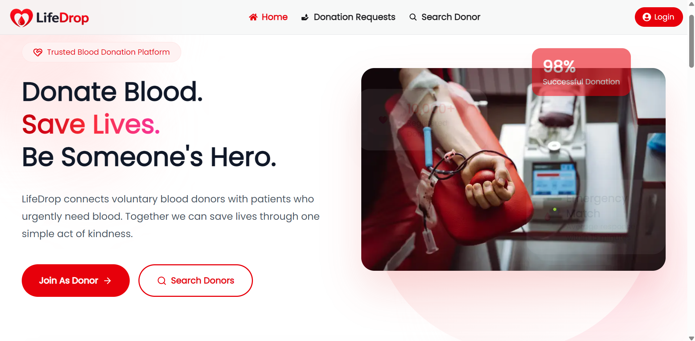
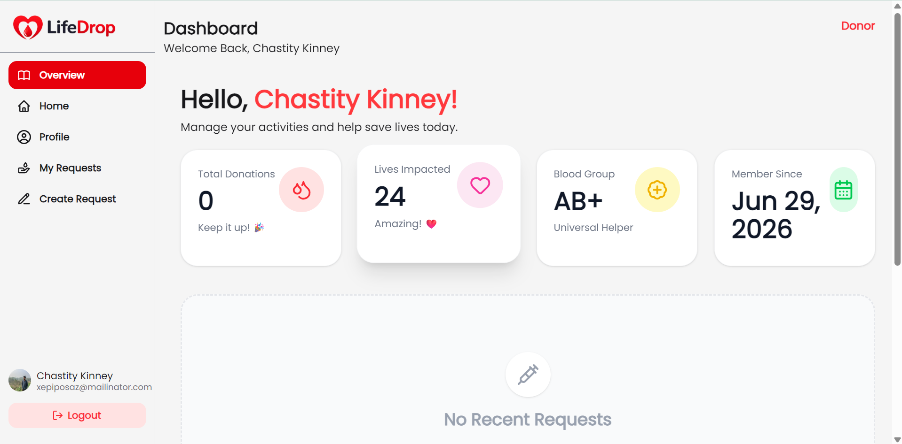
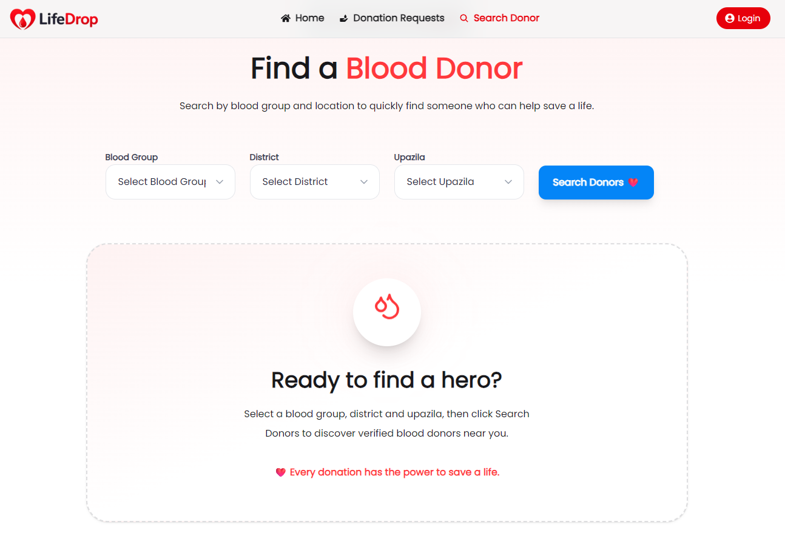
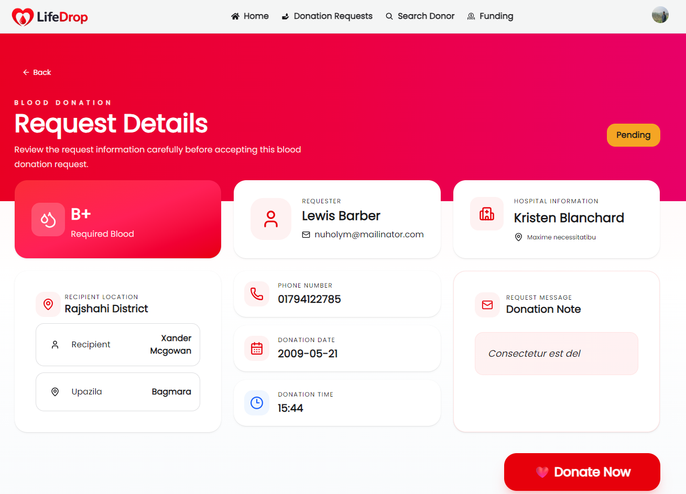
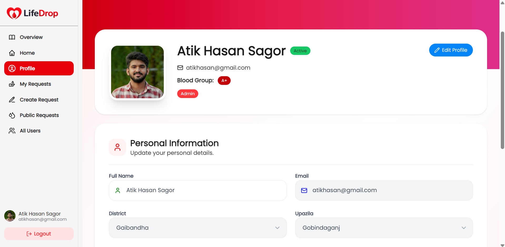

# 🩸 LifeDrop - Blood Donation Platform

LifeDrop is a modern blood donation platform that connects blood donors with people in need. The platform allows users to register as donors, search for blood donors, create blood donation requests, and manage donation activities through role-based dashboards.

## 🌐 Live Website

Frontend: https://lifedrop-client-cyan.vercel.app

---

# ✨ Key Features

### 🔐 Authentication

- User Registration
- User Login
- JWT Authentication
- Protected Routes
- Role Based Access Control

### 👤 User Roles

- Donor
- Volunteer
- Admin

### 🩸 Blood Donation

- Create Blood Donation Request
- Update Donation Request
- Delete Donation Request
- View Donation Details
- Donate Blood
- Donation Status Management

### 🔍 Search Donors

- Search by Blood Group
- Search by District
- Search by Upazila

### 👨‍💼 Admin Dashboard

- Dashboard Statistics
- Manage Users
- Block / Unblock Users
- Change User Role
- Manage All Donation Requests

### 🤝 Volunteer Dashboard

- View All Donation Requests
- Update Donation Status

### 👤 User Dashboard

- Manage Profile
- Edit Personal Information
- View My Donation Requests
- Create Donation Requests

### 💰 Funding

- Stripe Payment Integration
- Funding History

### 📱 UI Features

- Fully Responsive Design
- Modern Medical UI
- Premium Dashboard
- Loading Animations
- Beautiful Empty States
- HeroUI Components

---

# 🛠️ Technology Stack

## Frontend

- Next.js 15
- React 19
- Tailwind CSS
- HeroUI v3
- React Hook Form
- Zod
- Axios
- Framer Motion
- Lucide React
- React Icons
- Sonner / React Hot Toast
- Lottie React

## Backend

- Node.js
- Express.js
- MongoDB
- JWT
- Cookie Parser
- CORS
- dotenv

---

# 📦 NPM Packages

### Client

```bash
@heroui/react
@heroui/theme
@react-icons/all-files
axios
clsx
framer-motion
lucide-react
next
react
react-dom
react-hook-form
react-hot-toast
tailwindcss
lottie-react
```

### Server

```bash
cookie-parser
cors
dotenv
express
jsonwebtoken
mongodb
stripe
```


# 📸 Screenshots

- Home Page

- Dashboard

- Search Donor

- Donation Details

- Profile Page


---

# 🎯 Future Improvements

- Blood Donation History
- Real-time Notifications
- Chat Between Donor & Recipient
- Email Notifications
- Google Maps Integration
- AI Based Donor Recommendation

---

# 🙌 Acknowledgements

- Programming Hero
- HeroUI
- MongoDB
- Next.js
- Stripe
- ImgBB

---

# 📄 License

This project is created for educational purposes.